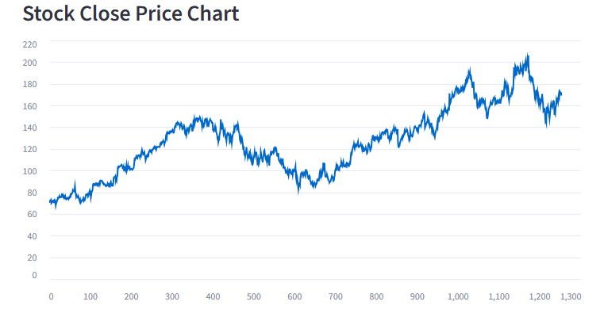
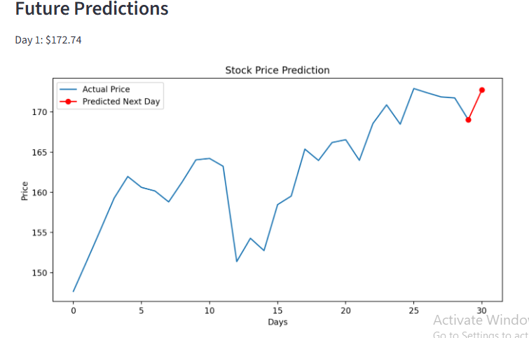
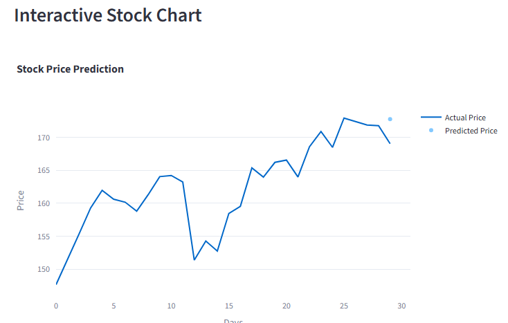

# **Google Stock Price Prediction - LSTM**

## Overview
This project implements a Stock Price Prediction System for Google (Alphabet Inc.) using Long Short-Term Memory (LSTM) neural networks. The goal is to predict the next day's closing price based on historical stock data. The app is built using Streamlit for an interactive dashboard.

## Features

* Interactive stock close price chart
* LSTM-based prediction for next-day closing price
* Automatic model training if no pre-trained model exists
* Saves and loads the model to avoid retraining every time
* Scales data using MinMaxScaler for better LSTM performance

## Dataset
* The app uses historical stock data (google.csv) with the following columns:
  
      * Date – The trading date
      * Open – Opening price
      * High – Highest price of the day
      * Low – Lowest price of the day
      * Close – Closing price
      * Adj Close – Adjusted closing price
      * Volume – Number of shares traded

## Installation
### 1. Clone Repository
```
git clone <your-repo-url>
cd <project-folder>
```
### 2. Install dependencies
```
pip install streamlit pandas numpy scikit-learn tensorflow
```
## Usage
### 1. Run the Streamlit app

```
streamlit run app.py
```   
### 2. Features in the app
   * Stock Close Price Chart: View historical closing prices
   * Next Day Prediction: Predict the next day’s closing price using LSTM
   * Model Training: If no trained model exists, the app will train one automatically

## Model Training
* The LSTM model uses 60 days of past closing prices to predict the next day.
* Model architecture:

   * Two LSTM layers (50 units each)
   * Dense output layer with 1 neuron
   * Optimizer: Adam
   * Loss: Mean Squared Error (MSE)
* Trained for 10 epochs with batch size of 32
* Model is saved in:

```
models\lstm_model.keras
```

## Visualizations



###  Interpretation
* The model's predictions are on average $3.41 away from the actual price.
* This is considered good accuracy for a basic LSTM stock prediction model.



## Future Improvements
* Add technical indicators (RSI, MACD) for better accuracy
* Deploy online for remote access

## 🚀 Live App

Try it live here 👉 [Open Live Demo](https://trafficdelayprediction-b9hdwappcnwuycajh4aakab.streamlit.app/)
